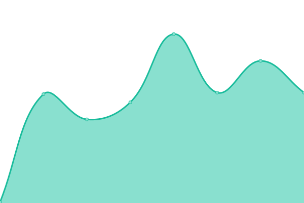

# [📈 Live Status](https://bhaveshkhatri81.github.io/Portfolio-Website-Status): <!--live status--> **🟧 Partial outage**

This repository contains the open-source uptime monitor and status page for [Bhavesh Khatri](https://bhaveshkhatri81.github.io/Portfolio-Website-Status), powered by [Upptime](https://github.com/upptime/upptime).

With [Upptime](https://upptime.js.org), you can get your own unlimited and free uptime monitor and status page, powered entirely by a GitHub repository. We use [Issues](https://github.com/bhaveshkhatri81/Portfolio-Website-Status/issues) as incident reports, [Actions](https://github.com/bhaveshkhatri81/Portfolio-Website-Status/actions) as uptime monitors, and [Pages](https://bhaveshkhatri81.github.io/Portfolio-Website-Status) for the status page.

Reference Video => <a href="https://www.youtube.com/watch?v=n_Fc7BHM-yE" target="_blank">Link</a>

<!--start: status pages-->
<!-- This summary is generated by Upptime (https://github.com/upptime/upptime) -->
<!-- Do not edit this manually, your changes will be overwritten -->
<!-- prettier-ignore -->
| URL | Status | History | Response Time | Uptime |
| --- | ------ | ------- | ------------- | ------ |
|  [Portfolio Website](http://bhaveshkhatri.tech) | 🟥 Down | [portfolio-website.yml](https://github.com/bhaveshkhatri81/Portfolio-Website-Status/commits/HEAD/history/portfolio-website.yml) | 

 3805ms
     
 | 

<a href="https://bhaveshkhatri81.github.io/Portfolio-Website-Status/history/portfolio-website">92.89%</a>
    

|  [Google](https://google.com) | 🟩 Up | [google.yml](https://github.com/bhaveshkhatri81/Portfolio-Website-Status/commits/HEAD/history/google.yml) | 

 169ms
     
 | 

<a href="https://bhaveshkhatri81.github.io/Portfolio-Website-Status/history/google">100.00%</a>
    

<!--end: status pages-->

[**Visit our status website →**](https://bhaveshkhatri81.github.io/Portfolio-Website-Status)

## 📄 License

- Powered by: [Upptime](https://github.com/upptime/upptime)
- Code: [MIT](./LICENSE) © [Anand Chowdhary](https://anandchowdhary.com), supported by [Pabio](https://pabio.com)
- Data in the `./history` directory: [Open Database License](https://opendatacommons.org/licenses/odbl/1-0/)
